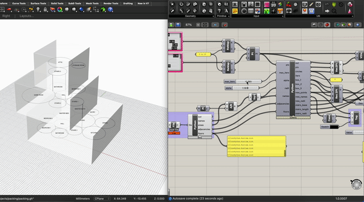

<h1>Computational Model for Architecture Bubble Diagrams</h1>

In the spirit of computational design, the Python code called in this Grasshopper file allows 
you to uncover the optimal locations for rooms within a structure by simply noting the corresponding area,adjancencies, and floor(s). All you need is a JSON file to produce a generative design.

Through this code, you can view the process in which each bubble is generated and then moved so that it does not collide with other bubbles while remaining touching them. The model also takes into account the size of each room, which is reflected by the area of each bubble.

<h2>Example Outputs:</h2>

By changing the adjancies and floors of rooms in a pre-existing JSON file, you can see how the model recalculates the optimal organization of rooms.

<h2>Views:</h2>

You are able to view this model as either a cluster of spheres with cylinders signifying stairways between floors, or as circles within floor cubes with lines signifying stairways between floors.

