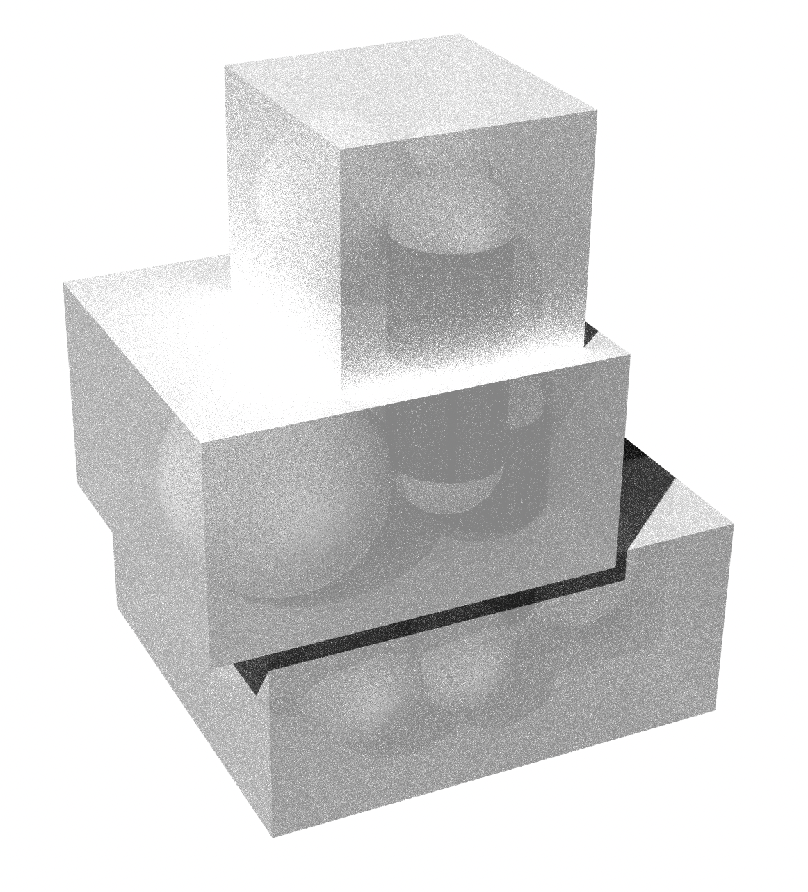
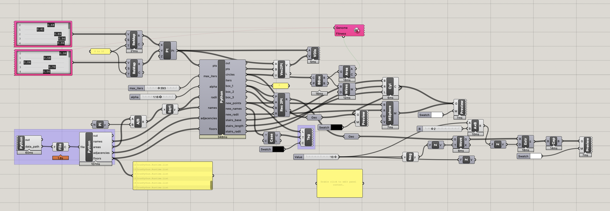

<h1>Computational Model for Architecture Bubble Diagrams</h1>

In the spirit of computational design, the Python code called in this Grasshopper file allows 
you to uncover the optimal locations for rooms within a structure by simply noting the corresponding adjancencies and floor(s). All you need is a JSON file to produce a generative design.

<h2>Example Outputs:</h2>

By changing the adjancies and floors of rooms in a pre-existing JSON file, you can see how the model recalculates the optimal organization of rooms.

<h2>Views:</h2>

You are able to view this model as either a cluster of spheres with cylinders signifying stairways between floors, or as circles within floor cubes with lines signifying stairways between floors.

